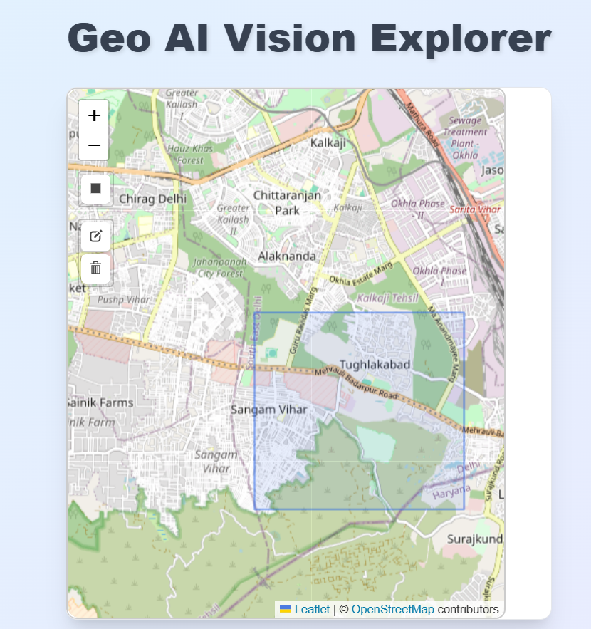
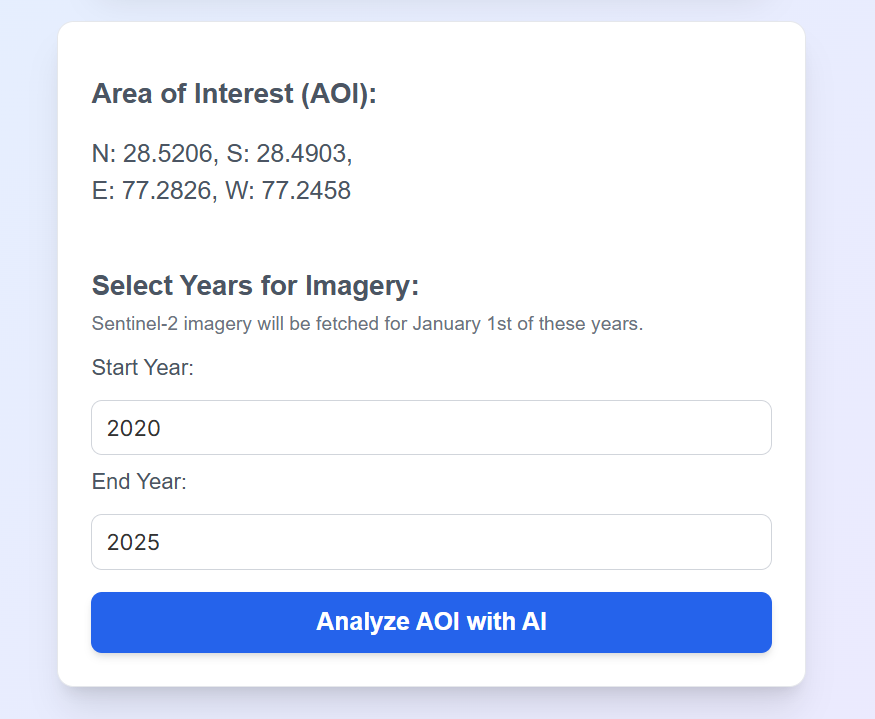

# Geo AI Vision Explorer 🌍🛰️

A powerful web application that combines satellite imagery analysis with AI-powered insights to monitor geographical changes over time. Users can draw areas of interest on an interactive map and receive AI-generated analysis of satellite data from different time periods.

## 📸 Screenshots


_Main interface showing the interactive map and controls_



_Drawing rectangle tool for area selection_

## ✨ Features

- **Interactive Map Interface**: Built with Leaflet and React-Leaflet for smooth map interactions
- **Drawing Tools**: Select areas of interest by drawing rectangles on the map
- **Satellite Imagery**: Fetch high-quality Sentinel-2 satellite data via Sentinel Hub API
- **AI-Powered Analysis**: Generate insights using Google's Gemini AI for geographical change detection
- **Time-Based Comparison**: Compare satellite imagery between different years (2015-present)
- **Caching System**: Redis-powered caching for improved performance and reduced API calls
- **Responsive Design**: Clean, modern UI that works across different screen sizes

## 🏗️ Architecture

### Frontend (React)

- **Framework**: React 18.3.1
- **Mapping**: Leaflet with React-Leaflet
- **Drawing Tools**: Leaflet-Draw integration
- **Styling**: Custom CSS with modern design patterns

### Backend (FastAPI)

- **Framework**: FastAPI with async support
- **AI Integration**: Google Gemini API for image analysis
- **Satellite Data**: Sentinel Hub API for Earth observation data
- **Caching**: Redis for response caching
- **Image Processing**: PIL for satellite image handling

## 🚀 Getting Started

### Prerequisites

- Node.js (v16 or higher)
- Python 3.8+
- Redis server
- API Keys:
  - Google Gemini API key
  - Sentinel Hub OAuth credentials

### Installation

1. **Clone the repository**

   ```bash
   git clone https://github.com/yourusername/geo-ai-monitor.git
   cd geo-ai-monitor
   ```

2. **Backend Setup**

   ```bash
   cd backend

   # Create virtual environment
   python -m venv venv
   source venv/bin/activate  # On Windows: venv\Scripts\activate

   # Install dependencies
   pip install -r requirements.txt

   # Create environment file
   cp .env.example .env
   ```

3. **Configure Environment Variables**

   Create a `.env` file in the backend directory:

   ```env
   GOOGLE_API_KEY=your_gemini_api_key_here
   SH_CLIENT_ID=your_sentinel_hub_client_id
   SH_CLIENT_SECRET=your_sentinel_hub_client_secret
   INSTANCE_ID=your_sentinel_hub_instance_id
   REDIS_URL=redis://localhost:6379
   ```

4. **Frontend Setup**

   ```bash
   cd ../frontend

   # Install dependencies
   npm install
   ```

5. **Start Services**

   **Terminal 1 - Redis (if running locally):**

   ```bash
   redis-server
   ```

   **Terminal 2 - Backend:**

   ```bash
   cd backend
   source venv/bin/activate  # On Windows: venv\Scripts\activate
   uvicorn main:app --reload --host 0.0.0.0 --port 8000
   ```

   **Terminal 3 - Frontend:**

   ```bash
   cd frontend
   npm start
   ```

6. **Access the Application**
   - Frontend: http://localhost:3000
   - Backend API: http://localhost:8000
   - API Documentation: http://localhost:8000/docs

## 🔧 Configuration

### API Keys Setup

#### Google Gemini API

1. Visit [Google AI Studio](https://aistudio.google.com/)
2. Create a new API key
3. Add to `.env` as `GOOGLE_API_KEY`

#### Sentinel Hub

1. Create account at [Sentinel Hub](https://www.sentinel-hub.com/)
2. Create a new OAuth client in your dashboard
3. Add credentials to `.env`:
   - `SH_CLIENT_ID`
   - `SH_CLIENT_SECRET`
   - `INSTANCE_ID`

### Environment Variables

| Variable           | Description                           | Required |
| ------------------ | ------------------------------------- | -------- |
| `GOOGLE_API_KEY`   | Google Gemini API key for AI analysis | Yes      |
| `SH_CLIENT_ID`     | Sentinel Hub OAuth client ID          | Yes      |
| `SH_CLIENT_SECRET` | Sentinel Hub OAuth client secret      | Yes      |
| `INSTANCE_ID`      | Sentinel Hub instance ID              | Yes      |
| `REDIS_URL`        | Redis connection URL                  | Optional |

## 📖 Usage

1. **Select Area**: Use the drawing tools (rectangle icon) on the map to select your area of interest
2. **Choose Time Period**: Set start and end years for comparison (2015-2025)
3. **Generate Analysis**: Click "Analyze AOI with AI" to fetch satellite data and generate insights
4. **View Results**: Review the AI-generated analysis and satellite imagery comparison

## 🛠️ Development

### Project Structure

```
geo-ai-monitor/
├── frontend/                 # React frontend
│   ├── src/
│   │   ├── App.js           # Main application component
│   │   ├── App.css          # Styling
│   │   └── index.js         # Entry point
│   ├── public/              # Static assets
│   └── package.json         # Dependencies
├── backend/                 # FastAPI backend
│   ├── main.py             # Main application
│   ├── requirements.txt    # Python dependencies
│   └── .env               # Environment variables
└── README.md              # This file
```

### Build Commands

**Frontend:**

```bash
npm start          # Development server
npm run build      # Production build
npm test           # Run tests
```

**Backend:**

```bash
uvicorn main:app --reload    # Development server
uvicorn main:app --host 0.0.0.0 --port 8000  # Production
```

## 🔍 API Documentation

The backend provides a RESTful API with the following main endpoint:

### `POST /generate-ai-response/`

Generates AI analysis for a given area and time period.

**Request Body:**

```json
{
  "bbox": {
    "north": 40.7829,
    "south": 40.7489,
    "east": -73.9441,
    "west": -73.9927
  },
  "start_date": "2020-01-01",
  "end_date": "2023-01-01"
}
```

**Response:**

```json
{
  "ai_response": "Analysis of geographical changes...",
  "image_url_1": "data:image/jpeg;base64,...",
  "image_url_2": "data:image/jpeg;base64,...",
  "cached": false
}
```

## 🤝 Contributing

1. Fork the repository
2. Create a feature branch (`git checkout -b feature/amazing-feature`)
3. Commit your changes (`git commit -m 'Add amazing feature'`)
4. Push to the branch (`git push origin feature/amazing-feature`)
5. Open a Pull Request

## 📝 License

This project is licensed under the MIT License - see the [LICENSE](LICENSE) file for details.

## 🙏 Acknowledgments

- [Sentinel Hub](https://www.sentinel-hub.com/) for satellite imagery
- [Google Gemini](https://ai.google.dev/) for AI analysis capabilities
- [Leaflet](https://leafletjs.com/) for interactive mapping
- [FastAPI](https://fastapi.tiangolo.com/) for the robust backend framework
- [React](https://reactjs.org/) for the frontend framework

## 🔮 Roadmap

- [ ] Add more satellite data sources
- [ ] Implement user authentication
- [ ] Add export functionality for analysis results
- [ ] Support for different drawing shapes (polygons, circles)
- [ ] Historical data visualization with charts
- [ ] Mobile app development

---

**Made with ❤️ for Earth observation and AI-powered insights**
